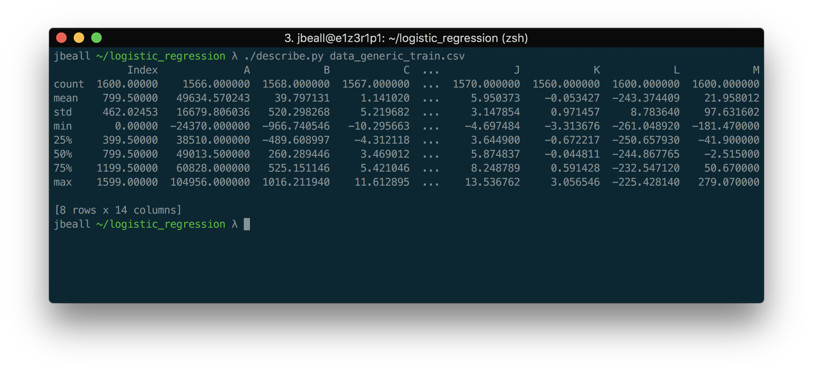
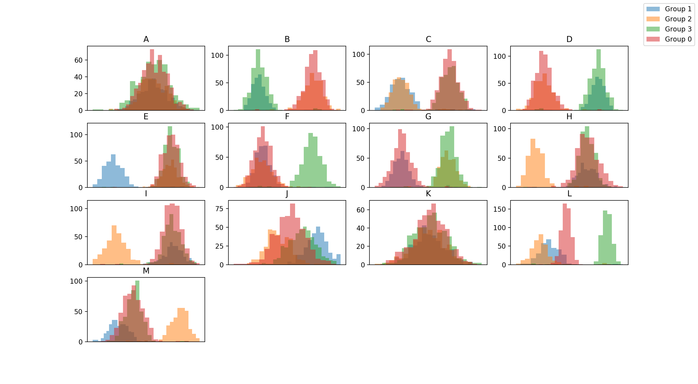
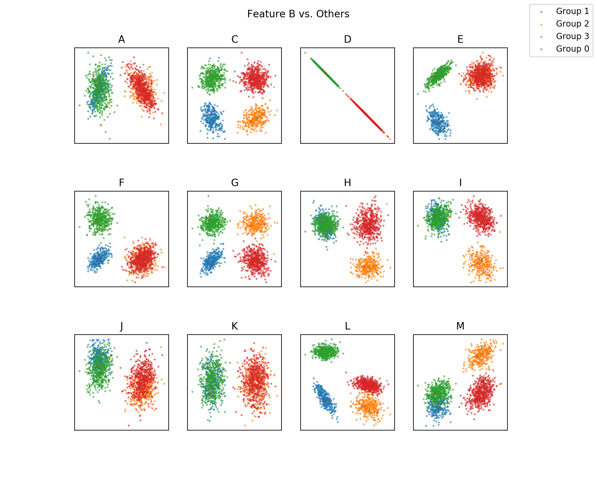
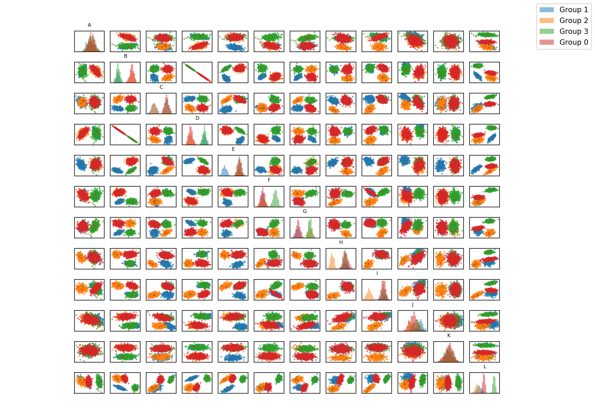
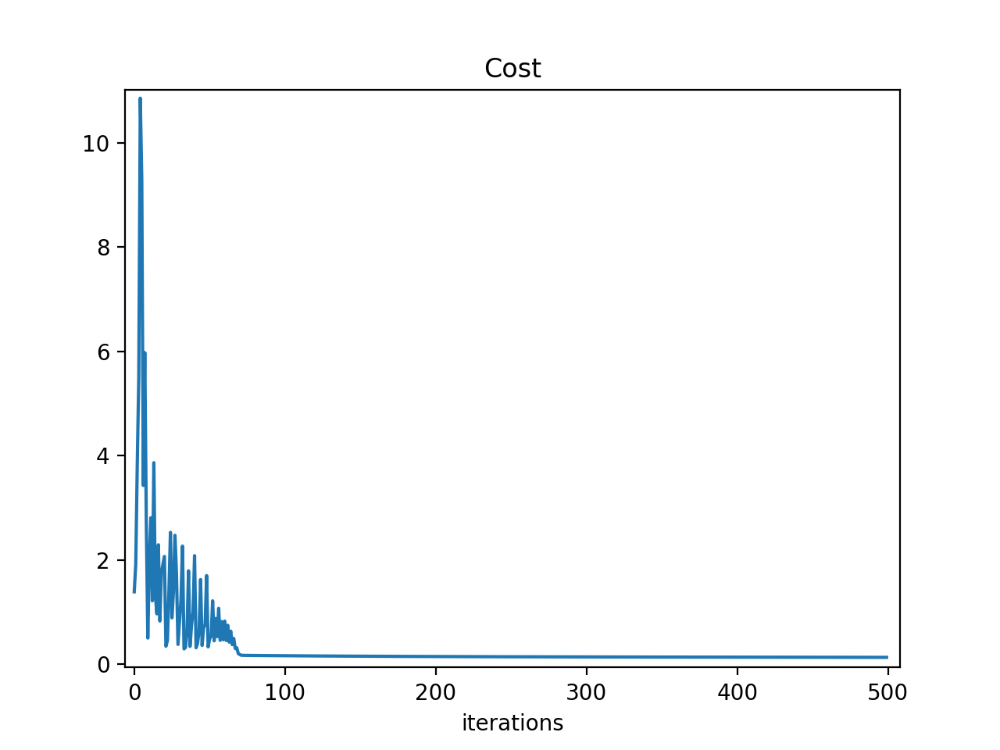
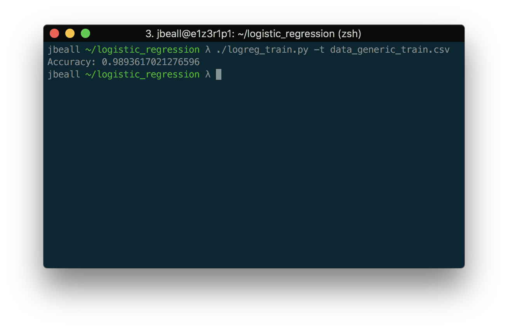

# logistic_regression
Binary logistic regression and Softmax Classifiers built from scratch in Python and Numpy for my own education.
I also made a MinMaxScalar and some graphing utilities for visualization and data normalization. A generic set of classifiable data is included to test the model.

#### Describe
Simply a recreation of Pandas's describe function


#### Histogram
Histograms for each feature


#### Scatter Plot
Scatter plots provide some insight into which features to use for classification


#### Pair Plot


#### Training
A model is instantiated to train on the normalized data
```python
logreg = MultiLogReg.MultiLogReg(plot=True)
logreg.train(x_train, y_train, 0.01, 500)
```
A graph of the model error can be produced:


The test script can split the training data to validate accuracy:


## Requirements
* Python3
* Pandas
* Numpy
* Matplotlib
* scikit-learn (for the test_train_split function)

## Setup
`pip install -r requirements.txt`

## Usage
`describe.py data.csv`

`histogram.py data.csv`

`scatter_plot.py data.csv`

`pair_plot.py data.csv`

`logreg_train.py [-p (plot)] [-t (test)] training_data.csv`
* output - model

`logreg_predict.py model.pkl testing_data.csv`
* output - csv of all test data points and their predicted classifications


